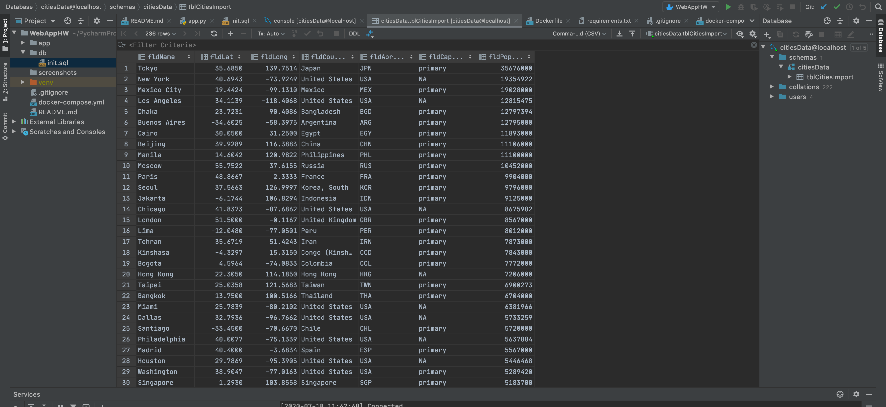
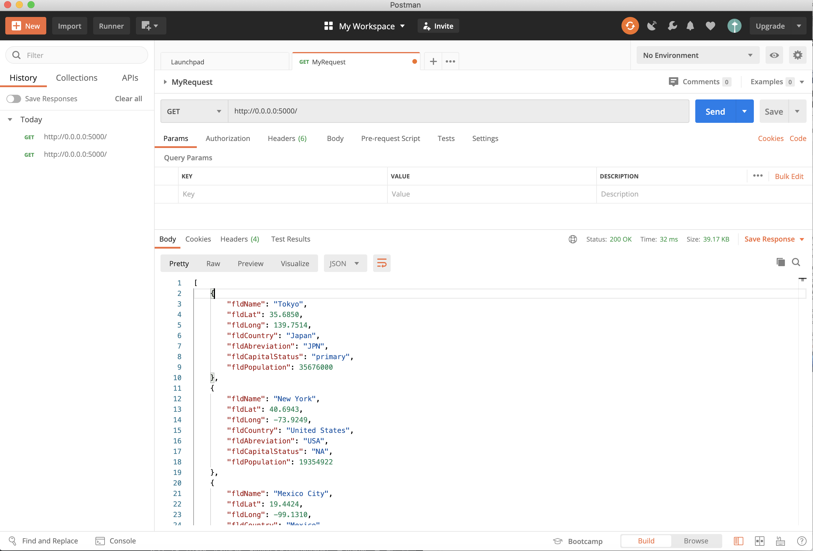
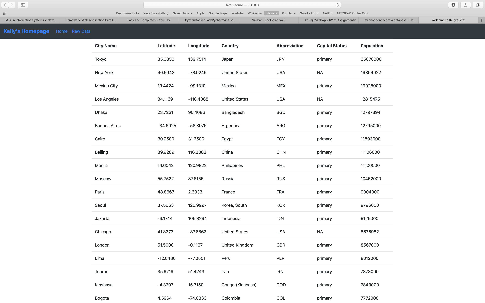

# Project Description
This project is a homework assignment intended to teach how to setup PyCharm with Docker, Flask, MySQL, and Postman.

## Screenshots

### Cities Data - SQL

### Postman

### Bootstrap
